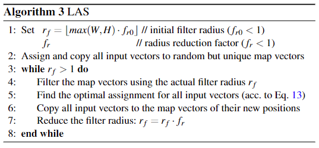

# LAS/FLAS & DPQ

This is an example implementation of the algorithms from the paper 

***Improved Evaluation and Generation of Grid Layouts using Distance Preservation Quality and Linear Assignment Sorting***
which was submitted to COMPUTER GRAPHICS Forum.  


</img>

### Abstract

Images sorted by similarity enables more images to be viewed simultaneously, and can be very useful for stock photo agencies or e-commerce applications. Visually sorted grid layouts attempt to arrange images so that their proximity on the grid corresponds as closely as possible to their similarity. Various metrics exist for evaluating such arrangements, but there is low experimental evidence on correlation between human perceived quality and metric value. We propose Distance Preservation Quality (DPQ) as a new metric to evaluate the quality of an arrangement. Extensive user testing revealed stronger correlation of DPQ with user-perceived quality and performance in image retrieval tasks compared to other metrics.
In addition, we introduce Fast Linear Assignment Sorting (FLAS) as a new algorithm for creating visually sorted grid layouts. FLAS achieves very good sorting qualities while improving run time and computational resources.

### Distance Preservation Quality (DPQ)

<div style="text-align:center">
    </img>
</div>


<div style="text-align:center">
    </img>
</div>

We define the Distance Preservation Gain ∆D as the difference between the average neighborhood distance of a random arrangement and a sorted arrangement S. The final Distance Preservation DPQ(S) is then the ratio between the p-norm of ∆D of given S and from a theoretical optimal arrangement, where all distances are perfectly preserved.

### LAS and FLAS

Both algorithmns sort a given number of vectors on a 2-dimensional grid using a linear-assignement solver. 

LAS (Linear Assignment Sorting) uses all vectors at each step, which results in good arrangements, but becomes quite slow with a large number of vectors. Linear Assignment Sorting is a simple algorithm with very good sorting quality. However, for larger sets the computational complexity of the LAS algorithm becomes too high. 

Fast Linear Assignments Sorting (FLAS) is able to handle larger quantities of vectors by replacing the global assignment with multiple local swaps. This approach allows much faster sorting while having little impact on the quality of the arrangement.


<p float="top" align="middle">
    </img>
    </img>
</p>

### Example

We provide a Jupyter notebook with full python code for both sorting algorithms and the quality measure DPQ:

[DPQ_LAS&FLAS](DPQ_LAS&FLAS.ipynb)

Please install the python packages listed in [requirements.txt](requirements.txt) before executing the notebook on your local machine

```bash
pip install -r requirements.txt
```